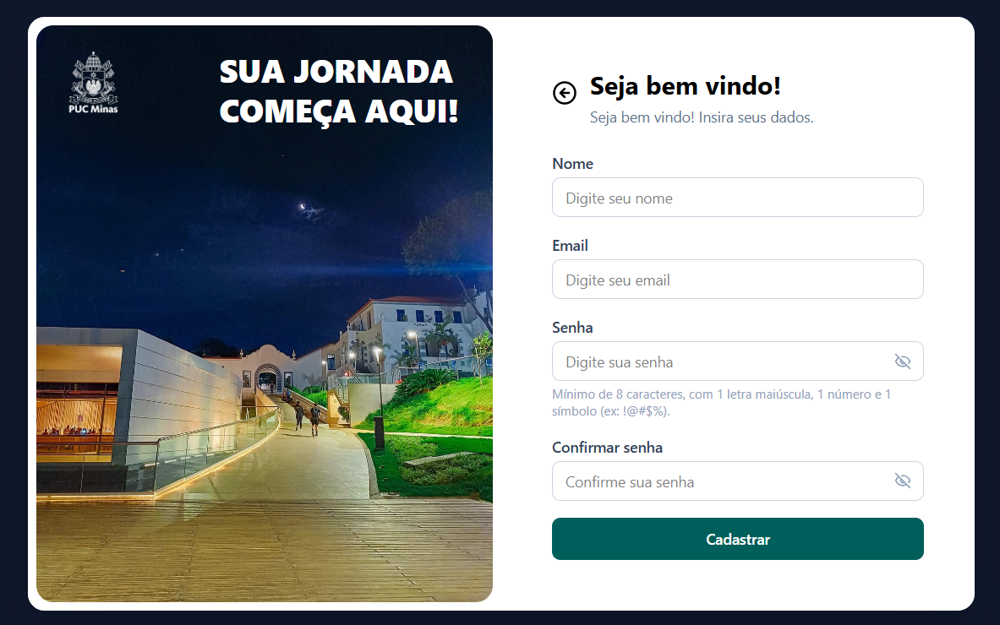
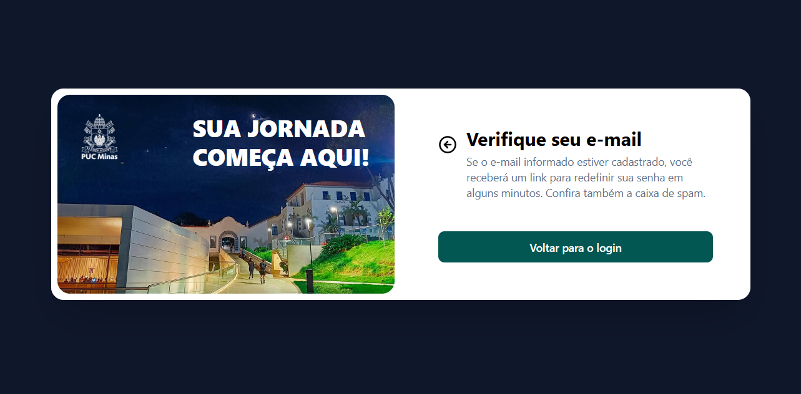
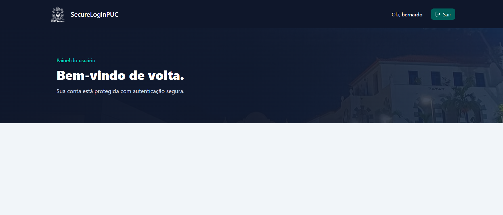
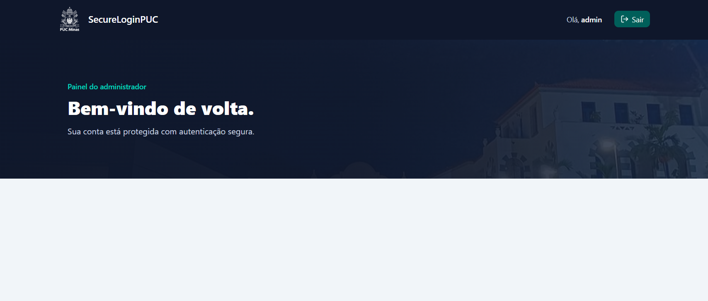

# 🔐 SecureLoginPUC

> Sistema de autenticação seguro desenvolvido em **Spring Boot**, com cadastro de usuários, login com controle de papéis (USER/ADMIN), recuperação de senha por e-mail e páginas renderizadas com **Thymeleaf**.

---

## 🚧 Status do Projeto


---

## 📚 Índice

- [Sobre o Projeto](#-sobre-o-projeto)
- [Funcionalidades Principais](#-funcionalidades-principais)
- [Tecnologias Utilizadas](#-tecnologias-utilizadas)
- [Arquitetura](#-arquitetura)
- [Modelo de Dados](#-modelo-de-dados)
- [Instalação e Execução](#-instalação-e-execução)
  - [Pré-requisitos](#pré-requisitos)
  - [Variáveis de Ambiente](#-variáveis-de-ambiente)
  - [Banco de Dados](#-banco-de-dados)
  - [Como Executar](#-como-executar)
- [Estrutura de Pastas](#-estrutura-de-pastas)
- [Rotas da Aplicação](#-rotas-da-aplicação)
- [Segurança](#-segurança)
- [Demonstração](#-demonstração)
- [Documentações Utilizadas](#-documentações-utilizadas)
- [Autor](#-autor)
- [Agradecimentos](#-agradecimentos)

---

## 📝 Sobre o Projeto

O **SecureLoginPUC** é um projeto acadêmico desenvolvido para a disciplina de **Desenvolvimento e Integração de Aplicações Web** da PUC Minas, com o objetivo de aplicar na prática os principais conceitos de autenticação e autorização em aplicações web usando **Spring Security**.

O sistema permite que usuários se cadastrem, façam login e recuperem sua senha por e-mail de forma segura, enquanto administradores têm acesso a um painel próprio, protegido por controle de papéis (roles). Todas as senhas são armazenadas com hash **BCrypt**, nunca em texto puro.

---

## ✨ Funcionalidades Principais

- 🔐 **Login seguro** com Spring Security, usando e-mail como identificador.
- 📝 **Cadastro de usuários** com validação de e-mail e nome de usuário duplicados.
- 🔑 **Recuperação de senha** via token único enviado por e-mail, com expiração de 10 minutos.
- 👥 **Controle de acesso por papéis**: usuários comuns (`USER`) e administradores (`ADMIN`), com páginas e rotas protegidas de acordo com a role.
- 📨 **Envio de e-mails** transacionais (recuperação de senha) via `JavaMailSender`.
- 🧑‍💻 **Criação automática de usuários padrão** (um USER e um ADMIN) na inicialização da aplicação, via `CommandLineRunner`.
- ⚠️ **Tratamento global de exceções** com `@ControllerAdvice`.
- 🎨 **Interface responsiva** com Thymeleaf + Tailwind CSS.

---

## 🛠 Tecnologias Utilizadas

### 🖥️ Back-end

- **Linguagem:** Java 25
- **Framework:** Spring Boot 4.1.1
- **Segurança:** Spring Security
- **Persistência:** Spring Data JPA / Hibernate
- **Banco de Dados:** H2 Database (arquivo local)
- **E-mail:** Spring Mail (`JavaMailSender`)
- **Build:** Maven

### 🎨 Front-end

- **Linguagem:** JavaScript
- **Template Engine:** Thymeleaf
- **Estilização:** Tailwind CSS (via CDN)
- **Ícones:** Lucide Icons

---

## 🏗 Arquitetura

O projeto segue uma arquitetura em camadas (estilo **MVC + Service Layer**), típica de aplicações Spring Boot:

- **`controller`** — Recebe as requisições HTTP e delega para a camada de serviço (`RegisterController`, `SecureLoginController`, `SendEmailController`).
- **`services`** — Concentra as regras de negócio (`UserService`, `PasswordResetService`, `SendEmailService`, `CustomUserDetailsService`).
- **`repositories`** — Interfaces `JpaRepository` para acesso ao banco de dados (`UserRepository`, `PasswordResetTokenRepository`).
- **`entities`** — Entidades JPA que representam as tabelas do banco (`User`, `PasswordResetToken`).
- **`dto`** — Objetos de transferência de dados usados pela API REST de e-mail (`EmailRequestDTO`).
- **`config`** — Configurações de segurança, usuários padrão e variáveis de ambiente (`SecurityConfig`, `DatabaseConfig`, `UserConfig`).
- **`exception`** — Tratamento centralizado de erros (`GlobalExceptionHandler`, `SendEmailException`).

### Fluxo de recuperação de senha

1. Usuário solicita recuperação informando o e-mail (`POST /recoverpassword`).
2. `PasswordResetService` gera um token único (`UUID`) com validade de 10 minutos e o salva vinculado ao usuário.
3. Um e-mail com o link de redefinição é enviado via `SendEmailService`.
4. Usuário acessa o link (`GET /resetpassword?token=...`), o token é validado.
5. Nova senha é definida (`POST /resetpassword`), o token é invalidado após o uso.

---

## 🧬 Modelo de Dados

| Entidade | Campos principais |
| :--- | :--- |
| **User** | `id`, `username` (único), `email` (único), `password` (hash), `role` |
| **PasswordResetToken** | `id`, `token` (único), `user` (FK), `expiryDate` |

---

## 🔧 Instalação e Execução

### Pré-requisitos

- **Java JDK 25** ou superior
- **Maven**
- **Git**
- Uma conta de e-mail com **senha de aplicativo** habilitada (ex: Gmail), para envio dos e-mails de recuperação de senha

---

### 🔑 Variáveis de Ambiente

O projeto usa a dependência `springboot4-dotenv`, que carrega automaticamente um arquivo `.env` na raiz do projeto. Copie o arquivo de exemplo e preencha com seus valores:

```bash
cp _env.example .env
```

| Variável | Descrição | Exemplo |
| :--- | :--- | :--- |
| `MAIL_USERNAME` | E-mail remetente usado pelo SMTP. | `seuemail@gmail.com` |
| `MAIL_PASSWORD` | Senha de aplicativo do e-mail remetente. | `xxxxxxxxxxxxxxxx` |
| `DEFAULT_USER_USERNAME` | Nome do usuário padrão (USER) criado na inicialização. | `bernardo` |
| `DEFAULT_USER_EMAIL` | E-mail do usuário padrão. | `bernardo@email.com` |
| `DEFAULT_USER_PASSWORD` | Senha do usuário padrão. | `4321` |
| `DEFAULT_ADMIN_USERNAME` | Nome do administrador padrão criado na inicialização. | `admin` |
| `DEFAULT_ADMIN_EMAIL` | E-mail do administrador padrão. | `admin@email.com` |
| `DEFAULT_ADMIN_PASSWORD` | Senha do administrador padrão. | `1234` |

> ⚠️ **Nunca** faça commit do arquivo `.env` com credenciais reais — apenas o `_env.example` deve ir para o repositório.

> ℹ️ O host, a porta do SMTP (`smtp.gmail.com:587`) e as demais configurações do H2 já estão fixados em `application.properties` e não são configuráveis via `.env` atualmente.

---

### 💾 Banco de Dados

O projeto usa **H2 Database** em modo arquivo (não é necessário instalar nem subir um banco separado). Os dados são persistidos em `./data/secureloginpuc` na raiz do projeto.

O Hibernate gerencia o schema automaticamente (via `spring.jpa.hibernate.ddl-auto=update`), criando as tabelas `users` e `password_reset_tokens` na primeira execução.

---

### ⚡ Como Executar

```bash
# Clone o repositório
git clone <URL_DO_SEU_REPOSITÓRIO>
cd SecureLoginPUC

# Execute com o Maven Wrapper
./mvnw clean install

./mvnw spring-boot:run
```

🚀 A aplicação estará disponível em **http://localhost:8080**.

Ao subir pela primeira vez, o `DatabaseConfig` cria automaticamente um usuário comum e um administrador, usando os dados definidos em `UserConfig` (via `application.properties`).

---

## 📂 Estrutura de Pastas

```
src/main/java/com/example/SecureLoginPUC/
├── SecureLoginPucApplication.java   # Classe principal (main)
│
├── config/
│   ├── SecurityConfig.java          # Regras de autenticação/autorização
│   ├── DatabaseConfig.java          # Criação dos usuários padrão (seed)
│   └── UserConfig.java              # Leitura das credenciais padrão via @Value
│
├── controller/
│   ├── SecureLoginController.java   # Login, home, admin, recuperação/redefinição de senha
│   ├── RegisterController.java      # Cadastro de novos usuários
│   └── SendEmailController.java     # API REST para envio de e-mails
│
├── dto/
│   └── EmailRequestDTO.java         # DTO usado pela API de e-mail
│
├── entities/
│   ├── User.java                    # Entidade de usuário
│   └── PasswordResetToken.java      # Entidade de token de redefinição de senha
│
├── exception/
│   ├── GlobalExceptionHandler.java  # Tratamento global de exceções
│   └── SendEmailException.java      # Exceção customizada de envio de e-mail
│
├── repositories/
│   ├── UserRepository.java
│   └── PasswordResetTokenRepository.java
│
└── services/
    ├── UserService.java             # Regras de cadastro
    ├── PasswordResetService.java    # Geração/validação de token e reset de senha
    ├── SendEmailService.java        # Envio de e-mails via JavaMailSender
    └── CustomUserDetailsService.java # Integração com Spring Security

src/main/resources/
├── application.properties
├── templates/                       # Páginas Thymeleaf (login, register, home, admin, ...)
└── static/                          # Imagens
```

---

## 🌐 Rotas da Aplicação

| Método | Rota | Acesso | Descrição |
| :--- | :--- | :--- | :--- |
| GET/POST | `/login` | Público | Página de login |
| GET/POST | `/register` | Público | Cadastro de novo usuário |
| GET | `/home` | Autenticado | Painel do usuário comum |
| GET | `/admin` | Somente `ADMIN` | Painel administrativo |
| GET/POST | `/recoverpassword` | Público | Solicitação de recuperação de senha |
| GET/POST | `/resetpassword` | Público (com token) | Redefinição de senha |
| GET | `/loginerror` | Público | Página de erro de login |
| POST | `/logout` | Autenticado | Logout |
| POST | `/api/email/send` | API interna | Envio programático de e-mails |

---

## 🛡 Segurança

- Senhas armazenadas com **BCrypt** (`BCryptPasswordEncoder`).
- Rotas administrativas (`/admin/**`) protegidas por **role-based access control** (`hasRole("ADMIN")`).
- Tokens de redefinição de senha são de **uso único** e expiram em **10 minutos**.
- A resposta de "recuperar senha" é sempre a mesma, exista ou não o e-mail cadastrado, evitando enumeração de usuários.
- Validação de senha forte (mínimo 8 caracteres, com letra maiúscula, número e símbolo) no front-end.

---

## 🎥 Demonstração

| Tela | Captura de Tela |
| :---: | :---: |
| **Tela de Login** | **Tela de Erro de Login** |
|  |  |
| **Tela de Cadastro** | **Tela de Recuperação de Senha** |
|  |  |
| **Tela de Envio de E-mail** | **Tela de Nova Senha** |
|  |  |
| **Tela de Início (Home) Usuário** | **Tela de Início (Home) Admin** |
|  |  |

---

## 🔗 Documentações Utilizadas

- 📖 [Spring Boot Reference Documentation](https://docs.spring.io/spring-boot/docs/current/reference/html/)
- 📖 [Spring Security Reference](https://docs.spring.io/spring-security/reference/)
- 📖 [Thymeleaf Documentation](https://www.thymeleaf.org/documentation.html)
- 📖 [Spring Data JPA](https://docs.spring.io/spring-data/jpa/docs/current/reference/html/)
- 📖 [Baeldung — Password Reset with Spring Security](https://www.baeldung.com/spring-security-password-reset-flow)

---

## 👤 Autor

| 👤 Nome | GitHub |
|---------|-------------------|
| Bernardo | [github.com/Bernardo-Guedes](https://github.com/Bernardo-Guedes) |

---

## 🙏 Agradecimentos
Em ambiente acadêmico, citar fontes e inspirações é crucial (integridade acadêmica). Em ambiente profissional, mostra humildade e conexão com a comunidade.

Gostaria de agradecer aos seguintes canais e pessoas que foram fundamentais para o desenvolvimento deste projeto:

* [**Engenharia de Software PUC Minas**](https://www.instagram.com/engsoftwarepucminas/) - Pelo apoio institucional, estrutura acadêmica e fomento à inovação e boas práticas de engenharia.
* [**Prof. Dr. João Paulo Aramuni**](https://github.com/joaopauloaramuni) - Pelos valiosos ensinamentos sobre **Arquitetura de Software** e **Padrões de Projeto**.

---